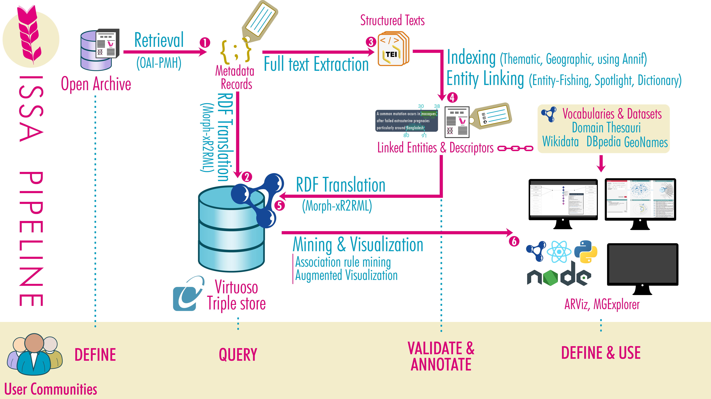

# ISSA Processing Pipeline
 
This repository contains the pipeline developed by the [ISSA](https://issa.cirad.fr/) project.
It orchestrates the automatic indexing of a scientific archive by extracting from the articles full-text thematic descriptors and named entities, and linking them with terminological resources in the Semantic Web format.

The repository consists of various tools, scripts and configuration files involved in each step of the pipeline:
- retrieve the articles metadata from the archive's API;
- download and pre-process the PDF files of the articles;
- process the output to extract thematic descriptors and named  entities;
- translate the output of each treatment into a unified, consistent RDF dataset;
- upload the resulting dataset to a triple store equipped with a SPARQL endpoint.

These steps are summurized in the following diagram.

## Content

- [Processing pipeline](pipeline/)
- [Tools related to Docker containers and third-party datasets](environment/)
- [RDF modeling](doc/data-modeling.md)
- [RDF examples](doc/examples/)
- [Vocabulary definitions and RDF dataset description](dataset/)

## License

See the [LICENSE file](LICENSE).

## Cite this work

Anna BOBASHEVA, Franck MICHEL, Andon TCHECHMEDJIEV, Anne TOULET (2022). ISSA Processing Pipeline. https://github.com/issa-project/issa-pipeline.
