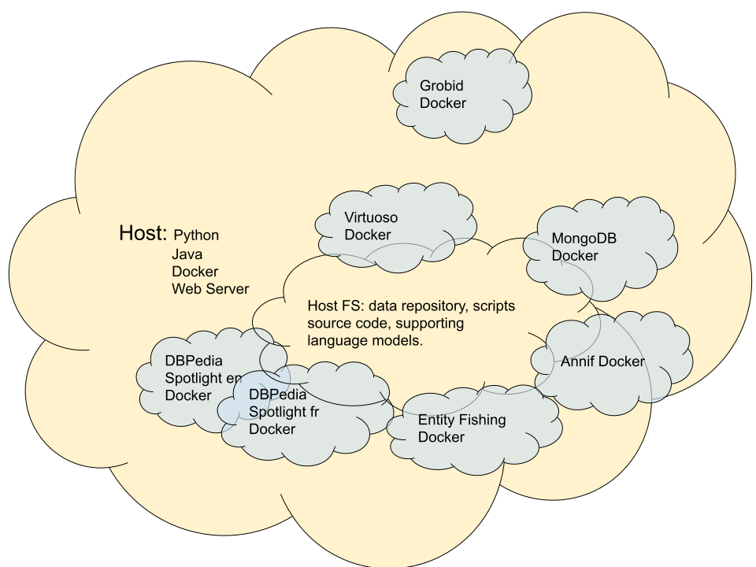

# ISSA Execution Environment

To facilitate the execution of the pipeline we built an environment that supports Python scripts and Java application execution and is capable of securely servicing HTTP requests. For using the third-party tools we heavily rely on Docker containers either off-the-shelf or custom-built. This provides a stable execution environment that is easy to maintain. Data persistence and interaction between the host machine and containers are enabled using Docker volumes.

## Host machine specification:

(minimum tested)

- 64-bit Linux OS
- CPU 2.30 GHz (multi-core is preferable)
- RAM 32 Gb

## Host environment components:

(tested versions)

- Python (3.6.8)
- Docker (24.0.5)
- Docker Compose (1.29.2)
- Apache web server (2.4.6)

The pipeline's Python scripts are run in the context of a virtual environment. The package requirements and virtual environment building script is included in this repository.

## Off-the-shelf Docker images:

- Grobid (0.7.2)
- Morph-xR2RML (1.3.2)
- Annif (0.55)
- DBPedia Spotlight (latest, no specific version tag is available)
- entity-fishing (0.0.6)
- OpenLink Virtuoso (7.2) 

Each image can be downloaded from the Docker Hub and we provide installation scripts in this repository.  

Morph-xR2RML is a multi-container Docker network. It requires Docker Compose to be installed on the host machine.

DBpedia Spotlight and entity-fishing are installed using pre-trained language models.  In our use case, we only download French and English models but this can be easily customized.

## Custom Docker images:

- pyclinrec (0.20)

For custom-built containers, we provide Dockerfile file(s) and build scripts.

## Optional external datasets

Optionally and depending on a use case some additional external datasets can be obtained from their origins and uploaded to the ISSA triple store for faster data access. In the Agritrop use case, we choose to host periodically updated Agrovoc thesaurus as well as application-specific AgrIST thesaurus. For the HAL use case, we host HAL domains and MeSH dataset.

To facilitate quick access to the Wikidata and DBpedia labels and hierarchical relationships between named entities for visualization applications such as [ARViz](https://github.com/Wimmics/arviz) we recreate the hierarchies for named entities in the ISSA triple store.

See the [datasets](../datasets) folder for more details.

## Scheduling updates

The pipeline is designed to be run periodically. The update frequency depends on the use case and the data source. For the _Agritrop_ and _HAL_ use cases, we run the pipeline monthly scheduling the runs with the [cron](https://en.wikipedia.org/wiki/Cron) utility. The scheduling [file](issa.crontab) is included in this repository for demonstration purposes.
