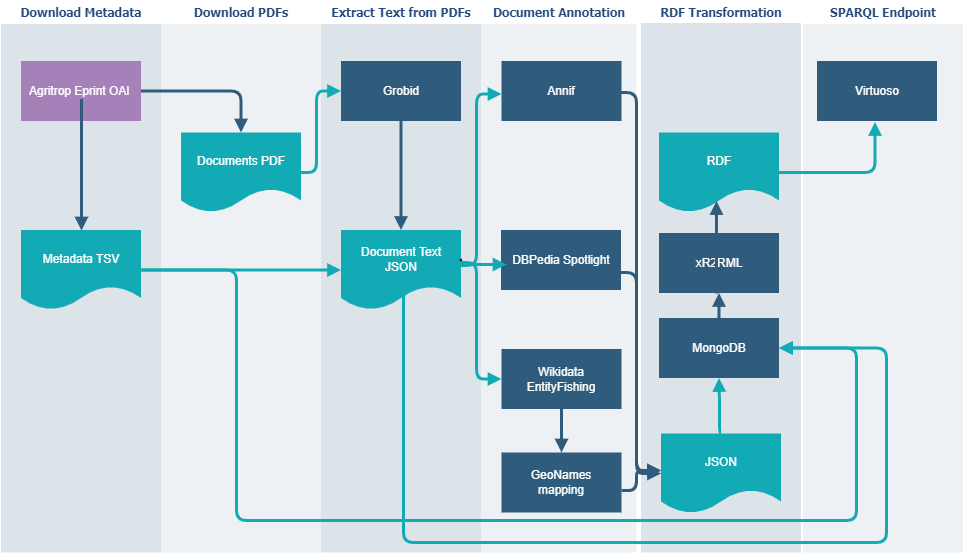

# ISSA Pipeline

ISSA pipeline consists of steps that flow document data from obtaining their metadata through the process of text extraction and annotation to the publication as a Knowledge Graph.



To adapt this pipeline to a different document corpus only files in the [config](../config) sub-directories have to be modified.

>:point_right: Before running the ISSA pipeline the [execution environment](../environment) has to be set up and running.

## Source Code

ISSA pipeline's source code is a combination of Python scripts for data processing and Linux bash scripts for data flow and tools integration.

## Configuration

ISSA pipeline can be configured for running multiple instances of document corpora, e.g. *agritrop* or *hal*. Each instance is configured in a separate directory in the [config](../config) sub-directory. The configuration files are:

- [env.sh](../config/agritrop/env.sh) - defines the environment variables for the pipeline execution such as data location, Docker containers configuration, etc.
- [config.py](../config/agritrop/config.py) - defines the processing options for Python scripts such as which steps to run, which models to use, etc.
- [dataset.ttl](../config/agritrop/dataset.ttl) - defines the RDF description metadata of the dataset Knowledge Graph.

>:point_right: To run the pipeline for a specific instance, the instance name has to be passed as an argument to the [run-pipeline.sh](./run-pipeline.sh) script. Or to run a specific script for a specific instance, the environment variable `ISSA_INSTANCE` has to be set to the name of the instance. 

Alternatively, in the case of a single instance, the configuration files may be placed in the root directories of the pipeline:

- environment definitions *env.sh* in the [root](..) directory
- Python scripts configuration config.py in the [pipeline](../pipeline) directory
- dataset metadata *dataset.ttl* in the [dataset](../dataset) directory

## Running Pipeline

After configuring the pipeline it can be run manually step-by-step by running numbered scripts in this directory or by invoking [run-pipeline.sh](run-pipeline.sh) with an instance name (e.g. *agritrop*) as an argument to run the entire pipeline automatically. Here is an example:

```
./run_pipeline.sh agritrop
```

We would recommend running the pipeline manually for the first time to be able to catch potential configuration issues earlier. Updates can be run automatically.

Each step of the pipeline outputs a log file that would be stored in the *./logs* directory.

>:point_right: The pipeline step scripts do not take the instance name as a parameter. To execute a single step on an ISSA instance set the *ISSA_INSTANCE* environment variable to the name of the instance before running a script.

## Data Updates

An initial run of ISSA pipeline creates a dataset file repository, intermediate storage, and resulting KG in the Virtuoso triple store.
After that ISSA pipeline can be run periodically to incrementally update the KG with new document data from the source.

On the update, metadata will be reprocessed in full to account for the updates in the source. However, the text extraction and annotation would be performed on the new documents only. The triple store will be updated accordingly.

The data is stored in the dataset directory and each update (including the initial load) is saved in the sub-directory with its date.

The periodic updates can be run automatically by scheduling the execution of [run-pipeline.sh](./run-pipeline.sh) script in crontab file. In the example below the pipeline for the *agritrop* instance is run on the 5th day of each month at 23:00.

```bash
# crontab -e
00 23 05 * * . $HOME/.bashrc; cd $HOME/ISSA-2/pipeline && ./run-pipeline.sh agritrop
```

## Pipeline Step-by-Step

### Download Metadata

Typically, documents in the repositories are accompanied by their metadata which can include title, authors, PDF URL, thematic descriptors, etc. 
The metadata typically comes in a tabular format and can be obtained through the repository's API.

In the use case of Agritrop the metadata is obtained through [OAI-PMH](https://www.openarchives.org/pmh/) protocol from the [Open Repository of CIRAD publications](https://agritrop.cirad.fr/). A mechanism for mapping API output to the table columns is provided.

The most relevant metadata fields for ISSA pipeline would be:

- id
- title
- abstract
- PDF URL
- thematic descriptors

After pre-processing metadata (which would be different for each use case scenario) the following output is generated:

- metadata TSV file
- metadata text (titles, abstracts) JSON according to the [schema](../doc/ISSA_json_schema.txt)
- <id>.url files containing PDF URLs to be used in the next step
- (optionally) TSV files with descriptors URIs and labels also for training the indexing models

Scripts are provided in [metadata](./metadata/) directory.

### Full Text Extraction

Typically, document repositories contain a title and possibly an abstract of a document in the metadata. For some use cases that may be enough to annotate a document. In this case, this step can be skipped.

In other cases an attempt to extract the text from PDF of a document is necessary. We use [GROBID (2008-2022)](https://github.com/kermitt2/grobid) machine learning library for extracting, parsing, and re-structuring raw documents.  

In this step for each PDF URL file created from the metadata:

- download PDF
- extract text
- (optionally) coalesce extracted text with metadata

The following intermediate files are produced at this point:

- extracted text JSON according to the [schema](../doc/ISSA_json_schema.txt)
- (optionally) extracted text coalesced with metadata JSON 
- (optionally) XML/TEI encoded documents output by Grobid (useful for debugging purposes)

>:point_right: text extraction is not always possible. For example, if a PDF file is a scan of a document.      
>:point_right: The extracted text is not always "clean" and can contain misaligned and missing parts of a text. To compensate for this, if a title and/or an abstract are available from the metadata they can be coalesced with extracted text into one JSON document.
>:point_right: A massive download of PDF documents from an HTTP server may cause problems for a host and a client. Caching of the PDF files is recommended and mechanisms are provided in the pipeline.

Scripts are provided in the directory [fulltext](./fulltext/).

### Thematic Indexing

In ISSA pipeline thematic indexing refers to the automatic annotation of a document with thematic descriptors. Thematic descriptors are keywords (typically 5 or 6) or expressions that characterize an article as a whole and that are linked to a domain-specific vocabulary. For some repositories, human documentalists manually annotate articles with descriptors, which yields accurate annotations but is time-consuming.

In the Agritrop use case, the thematic descriptors are chosen from the [AGROVOC](https://www.fao.org/agrovoc/) vocabulary. The large corpus of existing documents is already annotated by documentalists which allows training a specialized supervised classification model to automatically assign thematic descriptors to publications.

ISSA pipeline includes such a classification system through the integration of [Annif](https://annif.org/) [2], a framework developed by the National Library of Finland. Read more on Annif model selection and training [here](../training/README.md).

In this step from document text JSON files created in the previous step:

- create plain text files per Annif framework's requirement
- separate text files by language 
- extract thematic descriptors by applying classification models for each language

The following files are output at this step:

- text files
- JSON files with thematic descriptors according to the following schema

```
{'paper_id' <str>, 
 'model': <str>, 
 'language': <str>,   
 'subjects' : [{'uri': <str>,
              'label': <str>,
              'conf_score': <number>;,
              'rank': <number>}]
}
```

>:point_right: The classification models are trained separately for each language. See separate [documentation](https://github.com/issa-project/issa-pipeline/blob/main/training/README.md).

Scripts are provided in the directory [indexing](./indexing/).

### Named Entity Recognition

ISSA pipeline relies on tools to identify, disambiguate and link named entities from the documents:

- [DBpedia Spotlight](https://www.dbpedia-spotlight.org/) [3]
- [Entity-fishing](https://github.com/kermitt2/entity-fishing) [4]
- identifies geographic entities by looking for [GeoNames](https://www.geonames.org/ontology/documentation.html) mappings in the recognized Wikidata concepts
- [pyclinrec](https://github.com/twktheainur/pyclinrec) - Python Concept Recognition and Linking library - is used to identified  instance specific concepts according ot a specific vocabulary

In this step for each document's JSON file, the pipeline invokes each of these tools for each part of a document (title, abstract, body). The tool's responses are encapsulated into a simple schema:

```

{'paper_id' <str>, 
 'title':      { DBPedia Spotlight or Entity-fishing response }, 
 'abstract':   { DBPedia Spotlight or Entity-fishing response }, 
 'body_text' : { DBPedia Spotlight or Entity-fishing response }, 
}
```

The following output files are generated:

- JSON files with DBPedia named entities annotations
- JSON files with Wikidata named entities annotations
- JSON files with GeoNames named entities annotations
- JSON files with instance-specific named entities annotations


>:point_right: The tools' responses might be verbose and contain the full annotated text. The option to remove the text is provided to save space.
>:point_right: GeoNames named entities are saved in the same way as Wikidata with the addition of GeoNamesID field.

Scripts are provided in the directory [ner](./ner/).

### Transformation to RDF

The transformation of the metadata, document text, thematic descriptors and annotations is carried out using [Morph-xR2RML](https://github.com/frmichel/morph-xr2rml/) tool, an implementation of the [xR2RML mapping language](http://i3s.unice.fr/~fmichel/xr2rml_specification.html) [1] for MongoDB databases.

The previously collected data is

- imported to the [dockerized MongoDB](https://hub.docker.com/_/mongo) 
- transformed into RDF format by dockerized [Morph-xR2RML tool](https://hub.docker.com/r/frmichel/morph-xr2rml) following the provided mapping templates

The output of this step is a set of RDF files:

- Turtle (ttl) files with document metadata & text
- Turtle (ttl) files with thematic descriptors and domains
- Turtle (ttl) files with named entities

Scripts are provided in the directories [mongo](./morph-xr2rml/mongo/) and [xR2RML](./morph-xr2rml/xR2RML/).

### Uploading to Virtuoso Triple Store

RDF files generated at the previous stage are imported into a [dockerized Virtuoso OS instance](https://hub.docker.com/r/openlink/virtuoso-opensource-7/) as separate named graphs.

The full list of named graphs can be found [here](../doc/data-modeling.md#named-graphs).

Scripts are provided in the directory [virtuoso](./virtuoso/).

>:point_right: Each instance of the ISSA pipeline has to have its own Virtuoso Docker container. The Virtuoso container is configured in the [env.sh](../config/agritrop/env.sh) file.

## Extending Pipeline

ISSA pipeline is designed to be open to extension. Adding a new document processing requires only a few steps. See the [HOW-TO-EXTEND-PIPELINE](./HOW-TO-EXTEND-PIPELINE.md) documentation.

>:point_right: It would be even easier to remove a process from the pipeline by editing the calling scripts.

## References

[1] F. Michel, L. Djimenou, C. Faron-Zucker, and J. Montagnat. Translation of Relational and Non-Relational Databases into RDF with xR2RML.
In Proceedings of the *11th International Conference on Web Information Systems and Technologies (WEBIST 2015)*, Lisbon, Portugal, 2015.

[2] O. Suominen, J. Inkinen, T. Virolainen, M. Fürneisen,  B. P. Kinoshita, S. Veldhoen, M. Sjöberg, P. Zumstein, R. Neatherway, & M Lehtinen (2022). Annif (Version 0.58.0-dev) [Computer software]. https://doi.org/10.5281/zenodo.2578948.

[3] P. Mendes, M. Jakob, A. García-Silva, and C. Bizer. DBpedia spotlight: shedding light on the web of documents. In Proceedings of the 7th International Conference on Semantic Systems, pp. 1-8. 2011. https://doi.org/10.1145/2063518.2063519

[4] A. Bertino, L. Foppiano, J. Arias, A. Ekanger, K. Thoden. Entity-fishing for Scholarly Publishing: Challenges and Recommendations. [Computer software].  https://doi.org/10.5281/zenodo.1476474 

[5] GROBID (2008-2022) <https://github.com/kermitt2/grobid>
